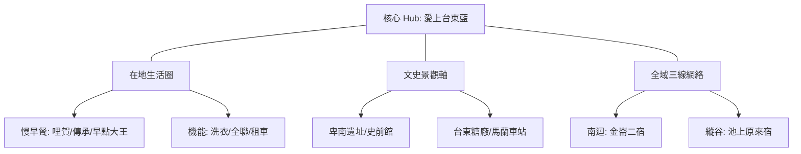

# 🏨 2026 台東市旅宿業者賦能實踐地圖 (ISMap)

本案展示如何落實「軟體定義地圖 (SDM)」與「地理編碼實戰」。以「愛上台東藍民宿」為樞紐，連結三條主題路徑與周邊 30+ 個生活採集點。

## 🗺️ 空間脈絡架構 (Mermaid View)

## 🧠 AI 深度探索 (Deep Research) Prompt
> [!TIP]
> 業者可現場複製此 Prompt 於手機：
> 「作為台東當地的旅宿經理，請根據本圖資中的 32 個實例點位：七里坡紅藜養生料理、三一牛肉麵館中興店、人x人、傳承手工蛋餅坊早餐店、卑南遺址公園 Peinan Site Park (Peinan archaeological park)、台東糖廠冰店、台東聖母健康農莊、哩賀早餐店、回家食間-台東拿手菜（Taiwanese home‘s kitchen)、國立臺灣史前文化博物館 National Museum of Prehistory、宋媽媽海產店、宏昌客家菜館（無菜單/預約制）、寶桑小吃（寶桑蚵嗲）、彭8草原廚房 La Pampa（萬富倉庫）、愛上台東藍民宿、成功豆花、旗遇海味、明奎早餐店、明隆春捲專賣店、池上福原豆腐店、深黑義法餐酒館、特選海產店、王記 鬼頭刀專賣店、石老爺臭豆腐店 (營業資訊依FB公告為主)、米舖客家小館、草民 Tsaomin、萬林肉粽 50年老店、賞味家早餐舖-豐年店、阿榮蘿蔔糕、響羅雷 原住民音樂餐廳、馬蘭零售市場、黃記肉粽肉羹。請為一對尋求深度文化的夫妻規劃一個『地景解碼』的一日行程。」

## 🔍 景點 Feature 索引
### 美食
*   [三一牛肉麵館中興店](?map=2026_taitung_city_enablement_case&feature=20260416_三一牛肉麵館中興店)
*   [傳承手工蛋餅坊早餐店](?map=2026_taitung_city_enablement_case&feature=20260416_傳承手工蛋餅坊早餐店)
*   [哩賀早餐店](?map=2026_taitung_city_enablement_case&feature=20260416_哩賀早餐店)
*   [明奎早餐店](?map=2026_taitung_city_enablement_case&feature=20260416_明奎早餐店)
*   [深黑義法餐酒館](?map=2026_taitung_city_enablement_case&feature=20260416_深黑義法餐酒館)
*   [賞味家早餐舖-豐年店](?map=2026_taitung_city_enablement_case&feature=20260416_賞味家早餐舖-豐年店)
*   [阿榮蘿蔔糕](?map=2026_taitung_city_enablement_case&feature=20260416_阿榮蘿蔔糕)
*   [響羅雷 原住民音樂餐廳](?map=2026_taitung_city_enablement_case&feature=20260416_響羅雷_原住民音樂餐廳)

### 服務據點
*   [七里坡紅藜養生料理](?map=2026_taitung_city_enablement_case&feature=20260416_七里坡紅藜養生料理)
*   [人x人](?map=2026_taitung_city_enablement_case&feature=20260416_人x人)
*   [台東糖廠冰店](?map=2026_taitung_city_enablement_case&feature=20260416_台東糖廠冰店)
*   [台東聖母健康農莊](?map=2026_taitung_city_enablement_case&feature=20260416_台東聖母健康農莊)
*   [回家食間-台東拿手菜（Taiwanese home‘s kitchen)](?map=2026_taitung_city_enablement_case&feature=20260416_回家食間-台東拿手菜（Taiwanese_home‘s_kitchen))
*   [宋媽媽海產店](?map=2026_taitung_city_enablement_case&feature=20260416_宋媽媽海產店)
*   [宏昌客家菜館（無菜單/預約制）](?map=2026_taitung_city_enablement_case&feature=20260416_宏昌客家菜館（無菜單_預約制）)
*   [寶桑小吃（寶桑蚵嗲）](?map=2026_taitung_city_enablement_case&feature=20260416_寶桑小吃（寶桑蚵嗲）)
*   [彭8草原廚房 La Pampa（萬富倉庫）](?map=2026_taitung_city_enablement_case&feature=20260416_彭8草原廚房_La_Pampa（萬富倉庫）)
*   [愛上台東藍民宿](?map=2026_taitung_city_enablement_case&feature=20260416_愛上台東藍民宿)
*   [成功豆花](?map=2026_taitung_city_enablement_case&feature=20260416_成功豆花)
*   [旗遇海味](?map=2026_taitung_city_enablement_case&feature=20260416_旗遇海味)
*   [明隆春捲專賣店](?map=2026_taitung_city_enablement_case&feature=20260416_明隆春捲專賣店)
*   [池上福原豆腐店](?map=2026_taitung_city_enablement_case&feature=20260416_池上福原豆腐店)
*   [特選海產店](?map=2026_taitung_city_enablement_case&feature=20260416_特選海產店)
*   [王記 鬼頭刀專賣店](?map=2026_taitung_city_enablement_case&feature=20260416_王記_鬼頭刀專賣店)
*   [石老爺臭豆腐店 (營業資訊依FB公告為主)](?map=2026_taitung_city_enablement_case&feature=20260416_石老爺臭豆腐店_(營業資訊依FB公告為主))
*   [米舖客家小館](?map=2026_taitung_city_enablement_case&feature=20260416_米舖客家小館)
*   [草民 Tsaomin](?map=2026_taitung_city_enablement_case&feature=20260416_草民_Tsaomin)
*   [萬林肉粽 50年老店](?map=2026_taitung_city_enablement_case&feature=20260416_萬林肉粽_50年老店)
*   [馬蘭零售市場](?map=2026_taitung_city_enablement_case&feature=20260416_馬蘭零售市場)
*   [黃記肉粽肉羹](?map=2026_taitung_city_enablement_case&feature=20260416_黃記肉粽肉羹)

### 人文史蹟
*   [卑南遺址公園 Peinan Site Park (Peinan archaeological park)](?map=2026_taitung_city_enablement_case&feature=20260416_卑南遺址公園_Peinan_Site_Park_(Peinan_archaeological_park))
*   [國立臺灣史前文化博物館 National Museum of Prehistory](?map=2026_taitung_city_enablement_case&feature=20260416_國立臺灣史前文化博物館_National_Museum_of_Prehistory)

### 美食
*   [三一牛肉麵館中興店](?map=2026_taitung_city_enablement_case&feature=20260416_三一牛肉麵館中興店)
*   [傳承手工蛋餅坊早餐店](?map=2026_taitung_city_enablement_case&feature=20260416_傳承手工蛋餅坊早餐店)
*   [哩賀早餐店](?map=2026_taitung_city_enablement_case&feature=20260416_哩賀早餐店)
*   [明奎早餐店](?map=2026_taitung_city_enablement_case&feature=20260416_明奎早餐店)
*   [深黑義法餐酒館](?map=2026_taitung_city_enablement_case&feature=20260416_深黑義法餐酒館)
*   [賞味家早餐舖-豐年店](?map=2026_taitung_city_enablement_case&feature=20260416_賞味家早餐舖-豐年店)
*   [阿榮蘿蔔糕](?map=2026_taitung_city_enablement_case&feature=20260416_阿榮蘿蔔糕)
*   [響羅雷 原住民音樂餐廳](?map=2026_taitung_city_enablement_case&feature=20260416_響羅雷_原住民音樂餐廳)

### 服務據點
*   [七里坡紅藜養生料理](?map=2026_taitung_city_enablement_case&feature=20260416_七里坡紅藜養生料理)
*   [人x人](?map=2026_taitung_city_enablement_case&feature=20260416_人x人)
*   [台東糖廠冰店](?map=2026_taitung_city_enablement_case&feature=20260416_台東糖廠冰店)
*   [台東聖母健康農莊](?map=2026_taitung_city_enablement_case&feature=20260416_台東聖母健康農莊)
*   [回家食間-台東拿手菜（Taiwanese home‘s kitchen)](?map=2026_taitung_city_enablement_case&feature=20260416_回家食間-台東拿手菜（Taiwanese_home‘s_kitchen))
*   [宋媽媽海產店](?map=2026_taitung_city_enablement_case&feature=20260416_宋媽媽海產店)
*   [宏昌客家菜館（無菜單/預約制）](?map=2026_taitung_city_enablement_case&feature=20260416_宏昌客家菜館（無菜單_預約制）)
*   [寶桑小吃（寶桑蚵嗲）](?map=2026_taitung_city_enablement_case&feature=20260416_寶桑小吃（寶桑蚵嗲）)
*   [彭8草原廚房 La Pampa（萬富倉庫）](?map=2026_taitung_city_enablement_case&feature=20260416_彭8草原廚房_La_Pampa（萬富倉庫）)
*   [愛上台東藍民宿](?map=2026_taitung_city_enablement_case&feature=20260416_愛上台東藍民宿)
*   [成功豆花](?map=2026_taitung_city_enablement_case&feature=20260416_成功豆花)
*   [旗遇海味](?map=2026_taitung_city_enablement_case&feature=20260416_旗遇海味)
*   [明隆春捲專賣店](?map=2026_taitung_city_enablement_case&feature=20260416_明隆春捲專賣店)
*   [池上福原豆腐店](?map=2026_taitung_city_enablement_case&feature=20260416_池上福原豆腐店)
*   [特選海產店](?map=2026_taitung_city_enablement_case&feature=20260416_特選海產店)
*   [王記 鬼頭刀專賣店](?map=2026_taitung_city_enablement_case&feature=20260416_王記_鬼頭刀專賣店)
*   [石老爺臭豆腐店 (營業資訊依FB公告為主)](?map=2026_taitung_city_enablement_case&feature=20260416_石老爺臭豆腐店_(營業資訊依FB公告為主))
*   [米舖客家小館](?map=2026_taitung_city_enablement_case&feature=20260416_米舖客家小館)
*   [草民 Tsaomin](?map=2026_taitung_city_enablement_case&feature=20260416_草民_Tsaomin)
*   [萬林肉粽 50年老店](?map=2026_taitung_city_enablement_case&feature=20260416_萬林肉粽_50年老店)
*   [馬蘭零售市場](?map=2026_taitung_city_enablement_case&feature=20260416_馬蘭零售市場)
*   [黃記肉粽肉羹](?map=2026_taitung_city_enablement_case&feature=20260416_黃記肉粽肉羹)

### 人文史蹟
*   [卑南遺址公園 Peinan Site Park (Peinan archaeological park)](?map=2026_taitung_city_enablement_case&feature=20260416_卑南遺址公園_Peinan_Site_Park_(Peinan_archaeological_park))
*   [國立臺灣史前文化博物館 National Museum of Prehistory](?map=2026_taitung_city_enablement_case&feature=20260416_國立臺灣史前文化博物館_National_Museum_of_Prehistory)

### 日常
*   [20260416_大武之心南迴驛.md](?map=2026_taitung_city_enablement_case&feature=20260416_大武之心南迴驛)
*   [20260416_馬蘭市場野菜街.md](?map=2026_taitung_city_enablement_case&feature=20260416_馬蘭市場野菜街)
*   [20260416_鼎倫牛肉麵.md](?map=2026_taitung_city_enablement_case&feature=20260416_鼎倫牛肉麵)

